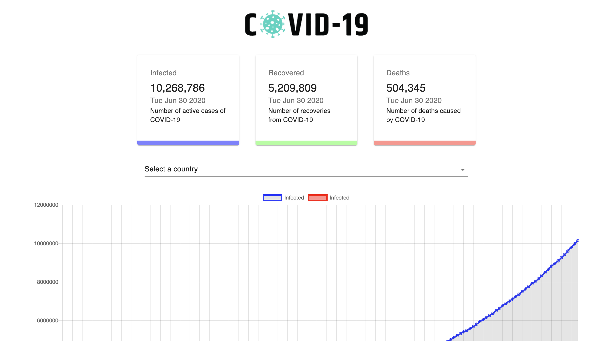

### Covid-19 Tracker

## Available Scripts

### You can view live version here:
- [My portfolio](https://covid19-tracker-2020.herokuapp.com/)

In the project directory, you can run:

### `npm start`

Runs the app in the development mode. 
Open [http://localhost:3000](http://localhost:3000) to view it in the browser.

The page will reload if you make edits. 
You will also see any lint errors in the console.

## Links

- [My portfolio](https://ridwan.co.uk/)
- [By me a coffee](https://ko-fi.com/R1D1M1LL)